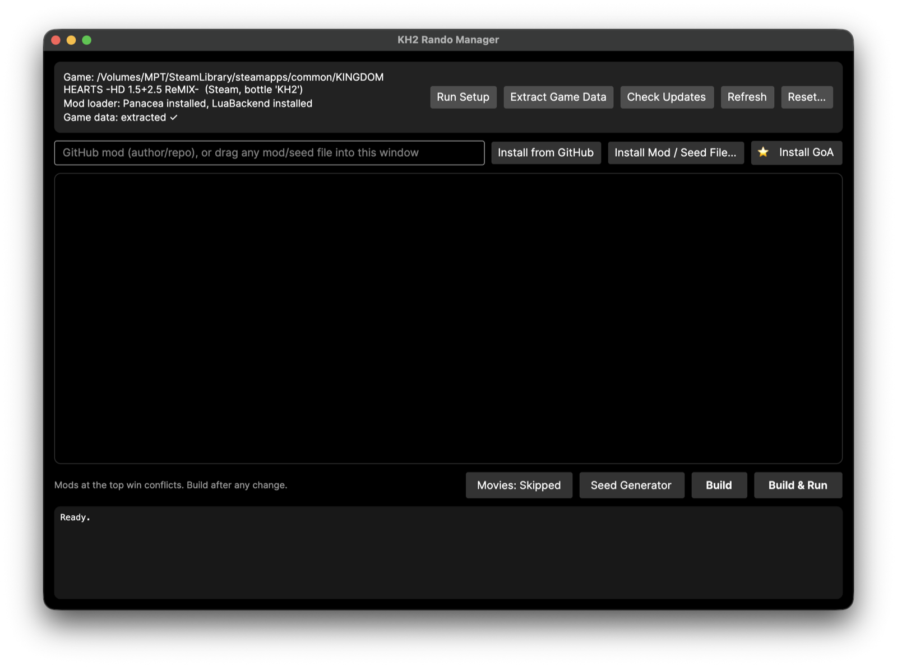
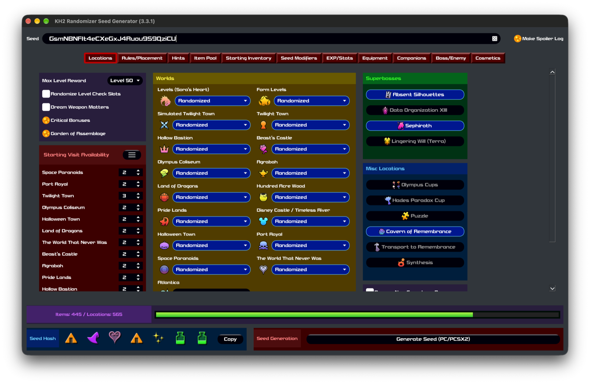

# kh2rando-mac

Mod manager for playing the [KH2 Randomizer](https://tommadness.github.io/KH2Randomizer/)
on macOS, with the game running through [CrossOver](https://www.codeweavers.com/crossover).

The Windows OpenKH Mods Manager does not run well under CrossOver. This is a native Mac
replacement for it: it extracts game data, installs mods and seeds, builds the mod
payload, and configures the CrossOver bottle so the Panacea mod loader works inside the
game. New users should start with the [Setup Guide](docs/SETUP.md).



Status: working, verified on Apple Silicon with the Steam version under CrossOver.
Releases are Apple Silicon only. Sikarugir wrappers are detected and can be set up
and built for, but the tracker, FPS HUD, and Re:Fined runtime install are CrossOver
only. See [docs/ROADMAP.md](docs/ROADMAP.md).

## Requirements

- A Mac with Apple Silicon, running macOS 14 (Sonoma) or newer
- CrossOver (or a Sikarugir wrapper) with KINGDOM HEARTS HD 1.5+2.5 ReMIX
  installed and working
- About 30 GB free disk space for the one-time game data extraction (plus about
  70 GB for the game itself if it is not installed yet)

## Setup

The detailed version with checkpoints and troubleshooting is the
[Setup Guide](docs/SETUP.md).

### 1. Install CrossOver and the game

1. Download [CrossOver](https://www.codeweavers.com/crossover) and drag it into
   Applications. It is the Mac app the game runs through; paid, with a free
   14-day trial. Sikarugir is a free alternative, but is untested at this time.
2. Open CrossOver and click Install. Search for Steam and install it; CrossOver
   creates a Windows 10 bottle for it. Uncheck "Run Steam" when the installer
   finishes. (Epic version: install "Epic Games Launcher" instead.)
3. Select the bottle. Under Advanced Settings, set Graphics to D3DMetal and turn
   on MSync.
4. Launch Steam from the bottle, log in, and install KINGDOM HEARTS HD 1.5+2.5
   ReMIX. It is about 70 GB; the Setup Guide covers putting it on an external
   drive.
5. Launch the game once, reach the KH2 title screen, then quit. The title screen
   is far enough; starting a New Game unmodded crashes at the opening cutscene,
   which is expected (see the Setup Guide).

### 2. Set up the randomizer

1. Download `KH2-Rando-Manager-*.zip` from the releases page, unzip, and move
   KH2 Rando Manager.app to Applications.
2. Quit Steam and the game inside CrossOver, then open KH2 Rando Manager and click
   Run Setup. It finds your game, installs the Panacea mod loader and LuaBackend
   into it, configures the bottle, and gets the item tracker ready. A few minutes.
3. Click Extract Game Data (one time, a few minutes, about 30 GB).
4. Click Install GoA. This is the Garden of Assemblage mod every seed builds on.
5. Click Movies to set "Movies: Skipped". Cutscenes crash the game under CrossOver;
   this makes the game skip them instead. Reversible.
6. Click Seed Generator. The first click installs the official
   [KH2 Randomizer seed generator](https://github.com/tommadness/KH2Randomizer)
   (a few minutes) and puts a KH2 Seed Generator app on your Desktop. Open it and
   click Generate Seed (PC/PCSX2) to save a seed zip.

   
7. Drag the seed zip onto the KH2 Rando Manager window, click Build, and wait for
   "Build complete".
8. Click Build & Run, or launch the game through Steam in CrossOver yourself, and
   start a New Game.

Playing a new seed after that: generate, drag the zip in, Build, play. Build again
after any mod change.

Optional: the Tracker button opens the community
[KH2 item tracker](https://github.com/Dee-Ayy/KH2Tracker) next to the game, with
auto-tracking. The first click installs it, which includes a one-time .NET
Framework install into the bottle and takes a few minutes; quit Steam and the
game first. After that it opens instantly.

The Manager also supports [Re:Fined](https://github.com/KH-ReFined/KH-ReFined),
the quality-of-life overhaul, either on its own or added to a randomizer
setup; see the [Setup Guide](docs/SETUP.md#optional-refined).

Export copies every installed mod and the load order into one folder, for a backup
or to hand someone your exact setup. Dropping that folder back onto the window (or
onto the dock icon) restores it, load order included.

There is also a command line version (`kh2rando`), published as a separate download
on the releases page; run `kh2rando help` for the commands. Diagnostics are written to `~/Library/Logs/kh2rando-mac.log`. Attach that
file to bug reports.

## How it works

Panacea, the in-game mod loader, is a Windows DLL loaded inside the game process, so it
runs under CrossOver the same way it runs under Proton for Linux and Steam Deck
players. Everything else (extracting game data, installing mods, building the mod
payload) is file work that runs natively on macOS using OpenKH's cross-platform .NET
libraries. The one CrossOver-specific piece, Wine DLL overrides and bottle-visible
Windows paths, is handled automatically. Details in [docs/RESEARCH.md](docs/RESEARCH.md).

## Building from source

Requires the .NET 8 SDK.

```sh
git clone --recurse-submodules https://github.com/macprotips/kh2rando-mac
cd kh2rando-mac
dotnet test src/Kh2RandoMac.Tests
dotnet publish src/Kh2RandoMac.Gui -c Release -r osx-arm64 --self-contained -o dist/gui-publish
bash packaging/make-app.sh dist/gui-publish dist
```

The last step assembles `KH2 Rando Manager.app`. Running the published executable
directly works, but it is missing the bundled seed generator installer, so the Seed
Generator button will report that the app is incomplete.

See [docs/DEVELOPMENT.md](docs/DEVELOPMENT.md) for architecture notes.

## Notes and disclaimers

- Unofficial. Not affiliated with Square Enix, Disney, CodeWeavers, the OpenKH team,
  or the KH2 Randomizer team. Report issues with this tool here, not to them.
- This changes your CrossOver bottle so the game can load mods: DLL overrides, and
  the .NET runtimes the item tracker and Re:Fined need. Your bottle is therefore no
  longer a stock CrossOver setup. If you hit a CrossOver problem, reproduce it in a
  clean version of CrossOver before asking CodeWeavers for help.
- No game assets are included or distributed. You need your own copy of the game.
- Setup writes three DLL-override entries to the bottle registry. The registry file is
  backed up first (`user.reg.kh2rando.bak`) and setup refuses to run while the bottle
  is in use. Setup is safe to re-run.
- Save files are not touched by this tool, but keep backups of saves you care about.
  They are in `Documents/My Games/KINGDOM HEARTS HD 1.5+2.5 ReMIX/` inside the bottle.

## Community

- [KH2FM Rando Discord](https://discord.gg/kh2fmrando) for randomizer questions
- [Mac Gaming Discord](https://discord.com/invite/Sdf3vNbUKm) for CrossOver and
  Mac gaming help

## Acknowledgements

This tool is a thin shell around other people's work. Everything it does that
matters to a player was built by someone else.

- **[OpenKH](https://github.com/OpenKH/OpenKh)** — Xeeynamo and the OpenKH team, for
  Panacea, the patcher and extraction libraries this reuses directly (vendored as a
  pinned submodule), and the Mods Manager this replaces on Windows.
- **[LuaBackend](https://github.com/Sirius902/LuaBackend)** — TopazTK and Sirius902,
  for the Lua hook every script mod depends on.
- **[KH2 Randomizer](https://github.com/tommadness/KH2Randomizer)** — tommadness and
  the KH2 Rando community, for the randomizer and its seed generator, which this
  installs and runs unmodified.
- **[Garden of Assemblage ROM Edition](https://github.com/KH2FM-Mods-Num/GoA-ROM-Edition)**
  — Num, for the mod every randomizer seed is built on.
- **[KH2 Tracker](https://github.com/Dee-Ayy/KH2Tracker)** — Dee-Ayy, for the item
  tracker, including the auto-tracking this runs beside the game.
- **[Re:Fined](https://github.com/KH-ReFined/KH-ReFined)** — TopazTK and contributors,
  for the quality-of-life overhaul this can install.
- **[KH-SteamDeck-Setup](https://github.com/KHOmega/KH-SteamDeck-Setup)** — KHOmega,
  for the Linux setup guides whose Wine recipes this port adapts to CrossOver.

The seed generator installer uses
[pyinstxtractor](https://github.com/extremecoders-re/pyinstxtractor) by
extremecoders-re, and a self-contained Python from
[python-build-standalone](https://github.com/astral-sh/python-build-standalone)
(MPL-2.0) so no Homebrew or developer tools are needed.

The app itself is built with [Avalonia](https://github.com/AvaloniaUI/Avalonia) (MIT)
and [LibGit2Sharp](https://github.com/libgit2/libgit2sharp) (MIT), on .NET. Mods run
under [CrossOver](https://www.codeweavers.com/crossover) by CodeWeavers, and through
it Wine, without which none of this would work on a Mac.

Thanks to Noah F.

Mods installed through this tool remain the work and property of their authors.

License: Apache-2.0 (see [LICENSE](LICENSE) and [NOTICE](NOTICE)).
