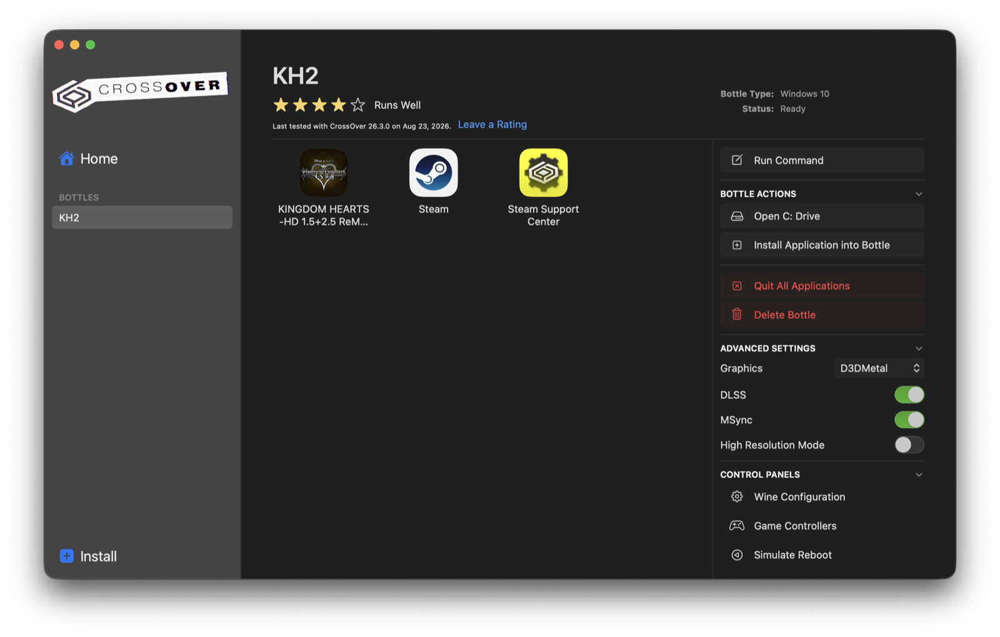

# Setup Guide

This guide takes you from a fresh Mac to playing a KH2 Randomizer seed. It assumes
you have never used CrossOver or modded a game before.

Once the game itself is installed, the modding side takes about 30 minutes, most
of which is waiting on the one-time extraction step.

## Before you start

Check you have:

- A Mac with Apple Silicon (M1 or newer; check Apple menu > About This Mac),
  running macOS 14 (Sonoma) or newer. Intel Macs are not supported.
- KINGDOM HEARTS HD 1.5+2.5 ReMIX purchased on Steam or the Epic Games Store
- About 100 GB of free disk space in total: the game is about 70 GB and the one-time
  data extraction is another 30 GB. Not enough room on your Mac? An external drive
  works; Part 1 covers it.
- CrossOver, which Part 1 covers. It is paid software with a free 14-day trial.

## Part 1: Get the game running

CrossOver is a Mac app that runs Windows programs. If the game already runs in
CrossOver on your Mac, skip to Part 2.

1. Download CrossOver from [codeweavers.com](https://www.codeweavers.com/crossover)
   and drag it into your Applications folder.
2. Open CrossOver and click Install. Search for Steam and install it. CrossOver
   creates a new Windows 10 bottle named Steam: a private Windows environment living
   in a folder on your Mac.
   (Epic Games Store version: search for "Epic Games Launcher" instead. Everything
   below works the same way.)
3. When the Steam installer finishes, uncheck "Run Steam" and click Finish. The
   next two steps should happen before Steam runs for the first time.
4. Select the Steam bottle in CrossOver's sidebar. Under Advanced Settings on the
   right, set Graphics to D3DMetal (Auto also works) and turn on MSync.

   
5. Recommended: store the game outside the bottle, in a separate folder or on an
   external drive, so the game survives if the bottle is ever replaced. This is also
   the way to go if your Mac's drive is too small for the 70 GB game.
   - Make a folder on the drive, for example "CX Steam Library".
   - In CrossOver, with the Steam bottle selected, open Wine Configuration (under
     Control Panels), go to the Drives tab, click Add, pick a free letter like X,
     then Browse and select the folder you made (external drives are under
     Volumes). Click OK, then Apply.
6. Double-click Steam in the bottle to launch it and log in.
7. If you added a drive in step 5: in Steam, open Steam menu, Settings, Storage,
   Add Drive, and pick the new drive.
8. Install KINGDOM HEARTS HD 1.5+2.5 ReMIX from your Steam library, choosing that
   drive if you added one.
9. Launch the game once, reach the KH2 title screen, then quit the game.
   The title screen is far enough. If you start a New Game here, the opening
   cutscene will crash the game. That is expected and fine: cutscenes need the
   Movies fix from Part 4, and once the game is modded the opening is skipped
   anyway.

Checkpoint: you saw the KH2 title screen. If the game will not run or runs badly,
that is a CrossOver question rather than a modding one; the CodeWeavers forums and
the [Mac Gaming Discord](https://discord.com/invite/Sdf3vNbUKm) are the places for
it.

## Part 2: Install KH2 Rando Manager

1. Download `KH2-Rando-Manager-*.zip` from the releases page.
2. In your Downloads folder, double-click the zip to unpack it, then drag
   KH2 Rando Manager.app into Applications.
3. Open it.

The status panel at the top of the window tells you what is set up and what to do
next.

## Part 3: One-time setup

1. Quit Steam inside CrossOver completely: right-click Steam's icon in the Dock and
   choose Quit, or use Exit in Steam's own menu. The game must be closed too. Setup
   changes a bottle setting that only saves correctly while nothing in the bottle is
   running; the app will refuse and tell you if something still is.
2. In KH2 Rando Manager, click Run Setup. It finds your game automatically, installs
   the mod loader into it, and configures the bottle. Watch the messages in the log
   panel at the bottom; it ends with "Setup complete."
   - If it cannot find the game, it asks you to pick the game folder yourself
     (the folder containing `KINGDOM HEARTS II FINAL MIX.exe`).
3. Click Extract Game Data. This unpacks the game's files so mods can be built
   against them. One time only, 10 to 20 minutes, about 30 GB. Leave the app open.

Checkpoint: the status panel reads "Mod loader: Panacea installed, LuaBackend
installed" and "Game data: extracted".

## Part 4: Install the base mod and test it

1. Click Install GoA. This downloads the Garden of Assemblage mod, the foundation
   every randomizer seed is built on.
2. Click Movies so the button reads "Movies: Skipped". Movie cutscenes crash the
   game under CrossOver; this makes the game skip them instead. Clicking again turns
   movies back on.
3. Click Build and wait for "Build complete" in the log.
4. Open Steam in CrossOver, launch Kingdom Hearts, and start a New Game in KH2.

Checkpoint: instead of the normal opening, you start in the Garden of Assemblage, a
round room full of portals. Quit the game.

## Part 5: Get the seed generator

Seeds are made by the official
[KH2 Randomizer seed generator](https://github.com/tommadness/KH2Randomizer), a
separate program from the KH2 Rando team.

1. In KH2 Rando Manager, click Seed Generator. Since it is not installed yet, the
   app installs it for you; this takes a few minutes and finishes with a
   KH2 Seed Generator app on your Desktop.

There is no official Mac download of the generator yet, so the button builds the
official source on your Mac. If you would rather set it up yourself, run
`tools/setup-seed-generator.sh` from this repo, or follow the from-source
instructions in the generator's own README.

## Part 6: Generate a seed

1. Open KH2 Seed Generator.
2. The seed name at the top determines the shuffle. Two people who use the same seed name
   and the same settings get an identical game, which is how races and co-op
   playthroughs work: one person generates, then shares the seed with the others.
3. The tabs (Locations, Rules/Placement, Hints, and so on) control what gets
   shuffled and how. The defaults are fine for a first seed. The Preset menu saves
   and loads whole settings sets, including community standards.
4. Optional: turn on Make Spoiler Log (top right) to also save an answer key showing
   where everything ended up. Handy for a first seed; leave it off for races.
5. Click Generate Seed (PC/PCSX2) and save the zip somewhere easy, like your
   Desktop.

The [KH2 Randomizer website](https://tommadness.github.io/KH2Randomizer/) documents
every setting, the hint systems, and daily seeds.

## Part 7: Play a seed

1. Make sure the game is closed (Steam can stay open).
2. Drag the seed zip onto the KH2 Rando Manager window.
3. Glance at the mod list: the seed should sit above GoA ROM Edition. It lands there
   automatically; the top entry wins if mods conflict.
4. Click Build, wait for "Build complete".
5. Launch the game and start a New Game.

That is the whole routine from now on:

    generate a seed  ->  drag it in  ->  Build  ->  play

## Optional: the item tracker

Most randomizer players keep an item tracker open next to the game. The Tracker
button opens the community [KH2 item tracker](https://github.com/Dee-Ayy/KH2Tracker)
with auto-tracking: it marks off checks by itself as you pick things up.

The first click installs it. That includes a one-time .NET Framework 4.8 install
into the bottle, which takes 15 to 30 minutes; quit the game and Steam in CrossOver
first, then leave it alone until the log says it is done. Every click after that
opens the tracker in a few seconds, and it is fine to open it while the game is
running.

If the tracker crashes on startup instead of opening, click Tracker again: the app
offers a Repair that reinstalls the bottle's .NET Framework cleanly (same 15 to 30
minutes, quit Steam first). This fixes bottles where an earlier install was left
half-finished.

In the tracker, turn on auto-tracking from its Options menu once the game is
running.

## Optional: Re:Fined instead of the randomizer

[Re:Fined](https://github.com/KH-ReFined/KH-ReFined) is a quality-of-life overhaul
for playing KH2 normally: skippable cutscenes, faster menus, and much more. It is a
different way to play than the randomizer, not an addition to it: the two rewrite
the same game systems and do not run together.

1. Click the Mode button (bottom left, it says "Mode: Randomizer"). The first
   switch offers to download Re:Fined; it is a large download.
2. After the download, the app switches to Re:Fined mode: your randomizer mods
   are parked, not lost, and Re:Fined is enabled. Click Build.
3. The first Build offers to install the .NET 8 Desktop Runtime into the bottle,
   which Re:Fined runs on. One time, a few minutes; quit Steam and the game first.
4. Launch the game. The title screen says "Re:Fined" when it worked. Its options
   live in the in-game config menu.

Click the Mode button again to go back: your randomizer mods return exactly as
they were; click Build to apply. Keep separate save slots for the two modes;
their saves are not interchangeable.

Add-on packs (voice packs, vanilla music) install the same way from the
[Re:Fined project page](https://github.com/KH-ReFined/KH-ReFined#additional-content);
place them above the main mod in the list. The Re:Fined project was finished and
archived by its authors in August 2026; the final version is what you get.

## Troubleshooting

- "Bottle appears to be running" during setup: something in the bottle is still
  alive. Quit Steam fully (right-click its icon, Exit), wait ten seconds, retry.
- "Game folder not reachable": your external drive is not plugged in. Plug it in and
  click Refresh.
- Game boots vanilla (no mods): click Build again and relaunch. Check the status
  panel says Panacea and LuaBackend are installed. If it persists, see the last
  item in this list.
- Game crashes at the moogle or starts in the wrong place: usually a leftover Lua
  script from an older install. Setup warns about this; empty the
  `Documents/My Games/KINGDOM HEARTS HD 1.5+2.5 ReMIX/scripts/kh2` folder inside the
  bottle and relaunch. In game, F2 lists which Lua scripts loaded.
- The game got a Steam/Epic update and mods broke: the status panel will say the
  game data is stale. Run Extract Game Data again, then Build.
- Game crashes when a movie cutscene starts: click the Movies button so the game
  skips cutscenes instead. See Part 4.
- Extraction fails partway: usually a full disk. Free up space and run Extract
  again; it is safe to repeat.
- The app will not open ("damaged" or "unidentified developer"): official releases
  are notarized, so re-download from the releases page. If you built from source
  yourself, right-click the app and choose Open, then Open again. Needed once.
- Anything else: click the Log button in the app. It opens Finder with the app's
  log file highlighted; attach that file to your bug report along with what the
  in-app log panel said. For randomizer gameplay questions (rules, hints,
  strategies), the [KH2FM Rando Discord](https://discord.gg/kh2fmrando) is where
  the players are.

Re-running Setup is always safe; the bottle registry is backed up
(`user.reg.kh2rando.bak` in the bottle folder) before it is touched.

## Removing everything

The Reset button (click twice to confirm) returns the game to vanilla: it removes
the mod loader, LuaBackend, and the bottle registry changes, and restores the movie
folder. Mods, seeds, and extracted data are kept, so running Setup again later
brings modding back in seconds. To remove those too, delete the `KH2 Rando` folder
in your home directory and the app itself.
